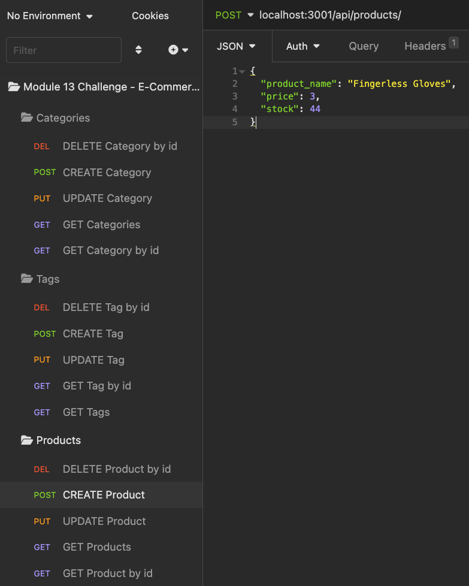

# ORM E-Commerce Backend 

## Description 
This application is the backend functionality of an E-commerce backend. It serves as a way to manage products, categories, and tags via an Express.js API and a MySQL database.

## Table of Contents

* [Installation](#installation)
* [Usage](#usage)
* [Credits](#credits)
* [License](#license)
* [Features](#features)
* [Contributing](#contributing)
* [Tests](#tests)
* [Questions](#questions)

## Video Demonstration
[Link to video demonstration](https://drive.google.com/file/d/1VWOJPBMK-4AU4msaf3SYaT2MQ4P9Kgx7/view)

## Screenshot

## Installation 
Clone the repository to your local machine, add MySQL credentials to a copy of the .evn example file, and install dependencies. Then, run the schema.sql to create the ecommerce database.

## Usage 
Once installed, start the server with npm start and, optionally, npm seed to add seed data to the database. Once the server is live, an application like Insomnia can be used to manually create GET, POST, PUT, and DELETE requests.

## Credits 
N/A

## License
This application is covered under the [MIT](https://opensource.org/licenses/MIT) license.

## Features 
This project utilizes an Express.js API and MySQL database, which we use Sequelize to interact with.

## Contributing 
N/A

## Tests 
N/A

## Questions 
* You can find me on GitHub at [PBodyBrooks](https://github.com/PBodyBrooks). 
* Please do not hesitate to reach out to me via my email: parkerlamarbrook@gmail.com.

